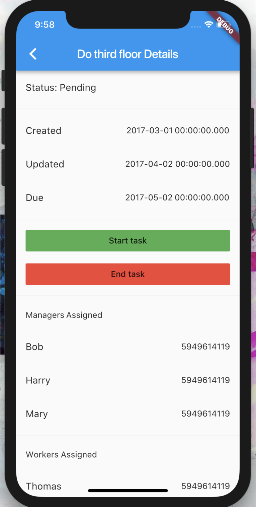

# Work Force Management Prototype

[Presentation](presentation.key)

This app was written as an open-source alternative to managing laborers (so that laborers and managers could efficiently communicate on projects such as the installation of CCTV cameras across all of a company's office).

# Installation

## Prerequisites

1. [Install](https://flutter.io/get-started/install/)
1. [Configure editor](https://flutter.io/get-started/editor/#androidstudio)

## Installing

Clone the repository using one of the following methods:
- HTTPS: `git clone https://github.com/neelkamath/work-force-management-prototype.git`
- SSH: `git clone git@github.com:neelkamath/work-force-management-prototype.git`

# Usage

1. Open `work-force-management-ui-prototype` in Android Studio.
1. Click **Tools > AVD Manager**.
1. Click **Create Virtual Device...**.
1. Click **Pixel 2 XL**.
1. Click **Next**.
1. Under the **x86 Images** tab, click **Download** for the Oreo image having an API level of 26, an ABI of x86_64, and targeting Android 8.0 (Google APIs).
1. Click **Next**.
1. Click **Finish**.
1. Double-click the AVD in the AVD manager to start it.
1. Click **Run > Run 'main.dart'** to run the app.

# Testing

1. `flutter packages get`
1. `flutter test`

# License

This project is under the [MIT License](LICENSE).
